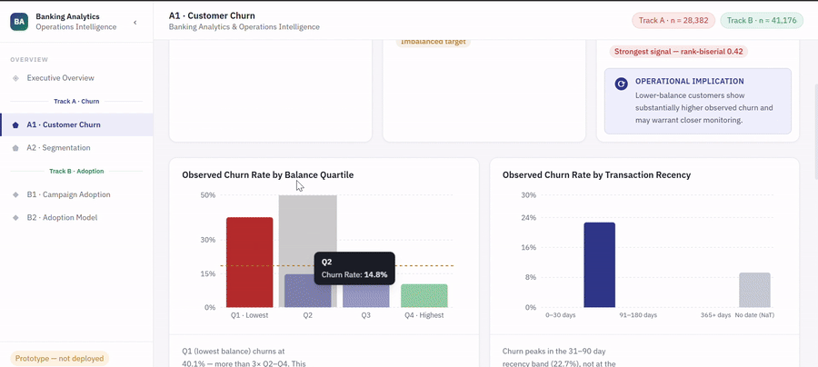
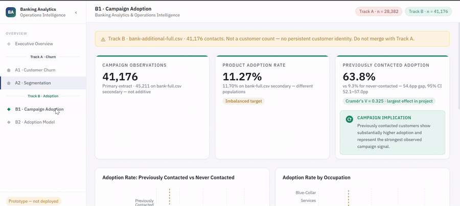
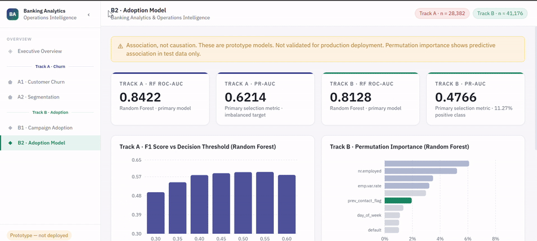

# Retail Banking Customer Intelligence & Wealth Analytics Platform

A two-track analytics project covering customer balance behavior and churn, and marketing campaign response and product adoption, for a retail bank. Built as a portfolio project, not a production system.

## 1. Project overview

This project analyzes two separate banking datasets end to end: data audit, cleaning, SQL modeling, statistical testing, customer segmentation, and predictive modeling, finishing in a dashboard. The two datasets describe different customer populations with no shared identifier, so the project is deliberately structured as two independent tracks rather than forced into one unified customer view. That decision, and the reasoning behind it, is documented in `docs/DATA_AUDIT.md` and treated as a first-class finding of the project, not a limitation to hide.

- **Track A: Customer Balance and Churn.** Who churns, and what distinguishes them.
- **Track B: Campaign and Product Adoption.** Who responds to a marketing campaign, and what drives adoption.

## 2. Business questions

- Which customer segments exist, and what distinguishes them?
- What characteristics are associated with churn in Track A?
- What characteristics are associated with product adoption in Track B?
- How much of adoption is explained by prior contact history versus client attributes versus macroeconomic conditions?
- Where would a retention or campaign team get the most value from prioritizing outreach?

## 3. Data sources

Full attribution and licensing detail is in `docs/DATA_SOURCES.md`.

- **Track A:** the Bank Customer Churn Data dataset (28,382 customers), Kaggle listing by Penta Krishna Kishore, license confirmed as Apache 2.0.
- **Track B:** the UCI Bank Marketing dataset (Moro, Cortez, Rita), two extracts: `bank-full.csv` (45,211 rows, includes account balance) and `bank-additional-full.csv` (41,188 rows, includes five macroeconomic indicators instead of balance). Public for research use with citation.

## 4. Data model

Two DuckDB schemas, matching the two tracks, in `db/banking_analytics.duckdb`:

- `track_a`: `dim_customer`, `fact_customer_balance`, `fact_customer_activity`, `fact_customer_churn`, joined on `customer_id`.
- `track_b`: `marketing_observation` (primary, from bank-additional-full.csv) and `marketing_observation_bank_full` (secondary). No customer key exists in the source data, so these are named as observations, not customers, and are never joined to Track A.

Full schema in `sql/01_create_schema.sql` and `sql/02_create_tables.sql`.

## 5. Methodology

Data audit, then cleaning and validation, then SQL schema and business-question queries, then statistical testing, then customer segmentation, then predictive modeling. Each phase is documented separately in `docs/` and every number in every document was produced by running the corresponding script, not estimated. See `docs/DATA_AUDIT.md` through `docs/MODELING.md` for the full trail.

## 6. Key findings

**Track A.** Current balance is the strongest signal associated with churn found in this project (Mann-Whitney rank-biserial correlation 0.42; churned customers hold a median balance of 1,541 versus 3,643 for retained customers). Net worth tier and age group are weak predictors by comparison (Cramér's V 0.017 and 0.046). Customer segmentation (k = 4) surfaced a "High Activity, High Churn" group, 25% of customers, that churns at 25.0% against 15 to 18% elsewhere, contradicting a simple "engaged customers are loyal customers" assumption. A Random Forest model reached 0.84 ROC-AUC / 0.62 PR-AUC on churn, with balance-related features dominating feature importance.

**Track B.** Prior contact with a client is by far the strongest lever for product adoption (63.8% adoption if previously contacted versus 9.3% if not, Cramér's V 0.325). A Random Forest model reached 0.81 ROC-AUC / 0.48 PR-AUC on adoption, and its feature importance surfaced something the statistical analysis alone had not emphasized: macroeconomic conditions (Euribor rate, employment level) matter more to predicted adoption than any individual client attribute.

All relationships reported are associations from observational data, not causal claims.

## 7. Dashboard

Dashboard mockups were built in Figma covering an executive overview, Track A segmentation and churn views, and Track B campaign and adoption views, sourced from the SQL views and model outputs in this repository. Every number shown on these screens comes directly from the files in `data/model_outputs/` and `docs/STATISTICAL_ANALYSIS.md`, not placeholder data.

**Track A, customer churn.** Observed churn rate by balance quartile and by transaction recency band.



**Track B, campaign adoption.** Campaign observation count, product adoption rate, and the previously-contacted-versus-never-contacted comparison, which is the strongest single effect found in this project.



**Track B, adoption model.** Model comparison across both tracks (ROC-AUC, PR-AUC) alongside Track B's permutation importance ranking.



**Figma prototype:** https://www.figma.com/make/jRv4U123Dn9Z1LbX5dhAMX/Enhance-Dashboard-Insights?t=6feeMjJq5IgHK5q3-6

## 8. Repository structure

```
docs/               data audit, cleaning, statistics, segmentation, metrics, modeling, and
                    handoff documentation for every phase
sql/                schema, table creation, load, and business-question SQL for both tracks
src/data/           cleaning, validation, feature configuration, and segmentation scripts
src/model/          Track A and Track B modeling scripts, shared evaluation utilities
data/processed/     cleaned datasets and segmentation outputs
data/model_outputs/ model comparison tables, feature importances, threshold sweeps
db/                 DuckDB database file (generated, not committed, see .gitignore)
raw/                original source files
```

## 9. Reproduction steps

```
pip install -r requirements.txt

python src/data/clean.py
python src/data/validate.py

python -c "import duckdb; con = duckdb.connect('db/banking_analytics.duckdb'); [con.execute(open(f).read()) for f in ['sql/01_create_schema.sql','sql/02_create_tables.sql','sql/03_load_transformations.sql','sql/04_track_a_analytics.sql','sql/05_track_b_analytics.sql']]"

python src/data/segment.py
python src/model/track_a_model.py
python src/model/track_b_model.py
```

Every script is deterministic (`random_state = 42` throughout) and was rerun from a clean state to confirm identical output before this README was written.

## 10. Limitations

- Track A and Track B describe different customer populations and are never combined into a single customer view; this is a deliberate modeling decision, not an oversight.
- Both target variables are imbalanced (churn 18.5%, adoption 11.3%); all reported metrics account for this rather than relying on accuracy alone.
- Neither model has undergone hyperparameter tuning, out-of-time validation, or a fairness/disparate-impact review. Both are analytical prototypes, not systems proposed for production use.
- Track B's source files contain no calendar year, only month and day, which limits any date-based analysis to a relative or seasonal view.
- Track A's dataset is used under the Apache 2.0 license listed on its Kaggle page; the underlying data appears to originate from a data science course assignment based on identical problem-statement text found elsewhere, which is recorded in `docs/DATA_SOURCES.md` as useful context but does not change the license under which the current Kaggle upload is made available.
